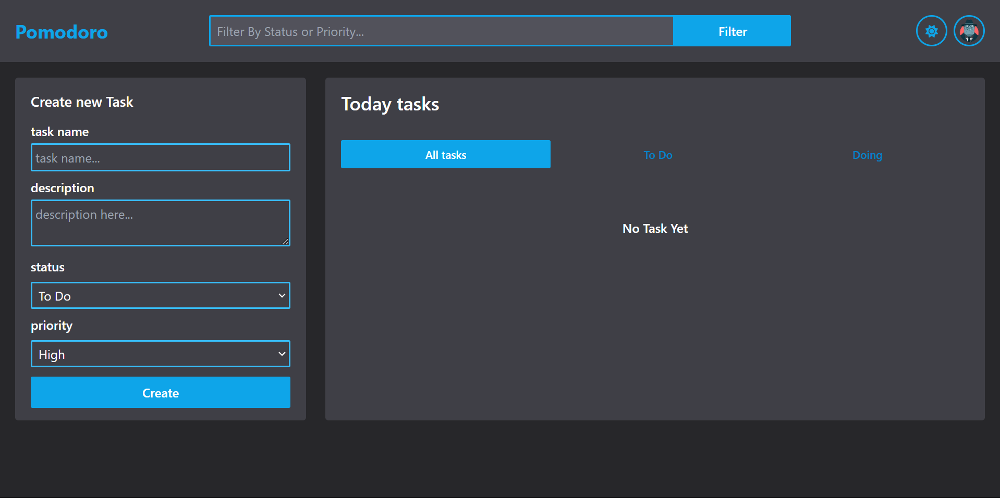
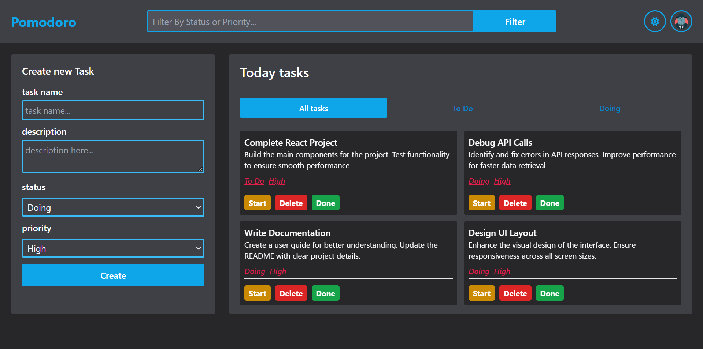
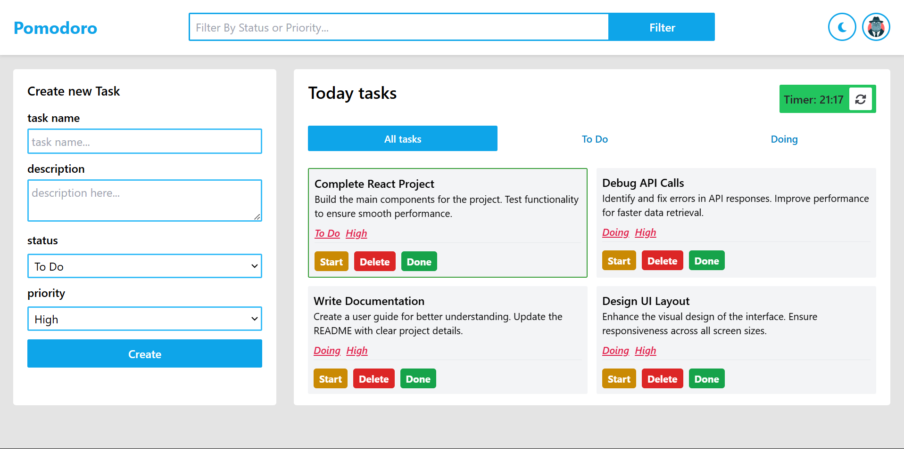
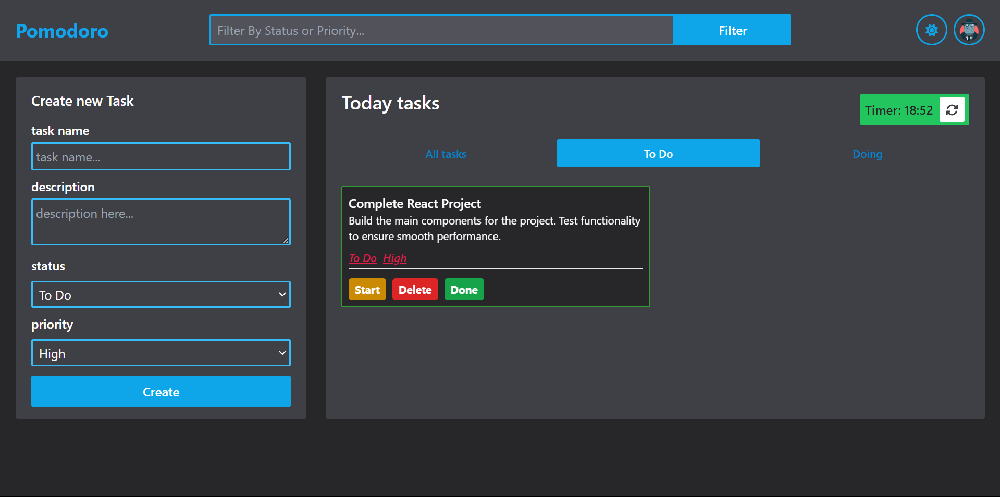

  
 

🍅 **Pomodoro App** 🍅  

The Pomodoro Technique is a time management method using 25-minute work sessions followed by 5-minute breaks. After four sessions, take a longer break to stay productive.

## Initial View

## Tasks [dark]

## Tasks [light]

## Set Timer

